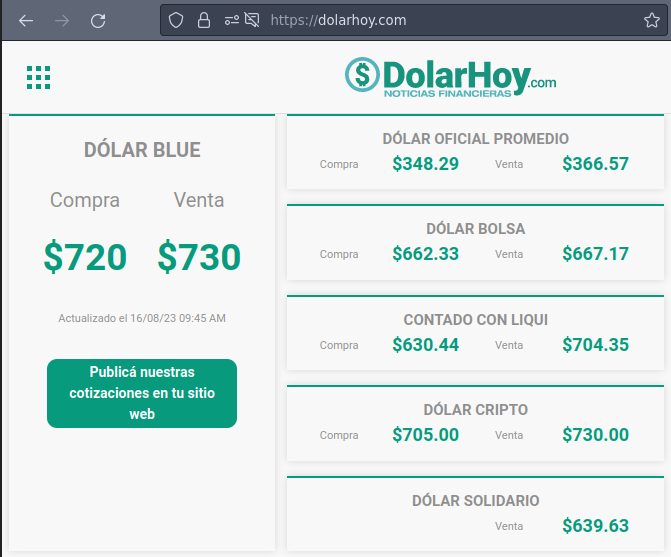
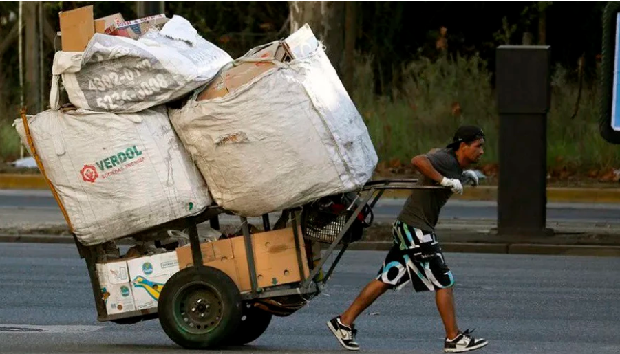

# Update

Almost three years ago I wrote an [introduction](./1. Introduction.md) where I said that the inflation was around fifty percent and that the hyperinflation was around the corner. Today, the inflation is about one hundred sixty percent (but nodoby really knows). The first lesson is that crisis are not easily predictable in the sense that you know that system is self destroying and cannot work but you never know for how long it can continuing imploding.

The gasoline price increased three time this week, before yesterday, yesterday and today again. The US Dollar/AR pesos exchange rate changes every single days since two months now, just one week ago you could by one UD Dollar with five hundred ninty three pesos, yesteday you had to pay seven hundred fourty pesos. However, according to my arbolito friend (the guy that buys and sells dollars, pesos, crypto, etc) nobody is selling US Dollars and that's why the exchange rate published work only as a reference but he doesn't sell dollars at that rate.

Note: this are the six more important exchange rates. On the streets, you can buy UD dollars at seven hundred thrity pesos (this dollar is illegal). The goverment sells dollars to three hundred sixty six pesos to their friends. You can also read that there is a "solidarity dollar rate" (you would never understand it)

Things prices rise really fast while people's prices don't. Yesterday afternoom I had to patch a tire and I paid one thounsand pesos for that work (~1.2 dollars). Also yesterday I had to buy a yubikey for backup and I paid eighty six thousand pesos for that what is more or less 115 dollars (illegals) or 230 dollars at official rate. This is what happens when you figth the capital and you win. Sorry, I am not neutral, I am writting at realtime while I see people pulling carts full of garbage like animals and while I listen to the Peronist March's "fighting the capital" phrase from an old, and by sure drank, man that cross the sideway of my house.

Note: I took this picture from internet but it is exactly what I see everyday. In fact, this guy has some protection for his hands and the cart seems well design while the ones I see are much worse.

